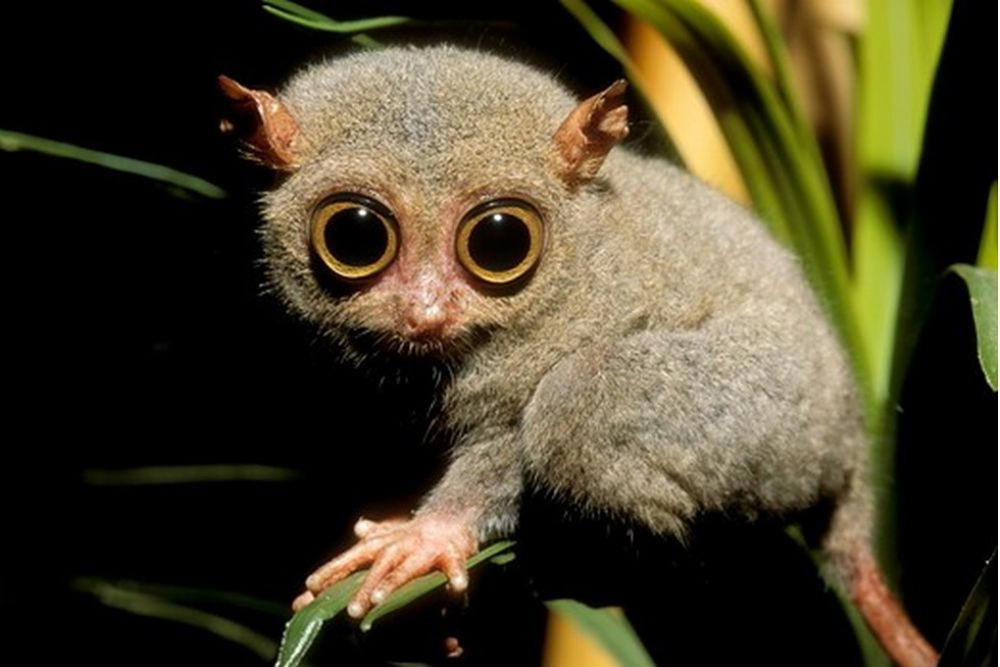

# Tarsier

> What is a Tarsier you ask? 
> A Tarsier is a small carnivorous primate. They are very meticulous and have some of the largest eyes to body size in all nature.

### What does the Tarsier have to do with this project?

> Glad you asked, nothing really other than the fact it is a neat animal. 

### The goal of this application?

> To learn mostly. But if we create the best dang code collaboration tool ever, that would be a bonus.
>
> This project aims to allow users to collaborate in an isolated development environment located on the server.
> We will be able to empower those who can only afford a chrome book to setup and develop in a virtual development
> environment. 
>
> This software will always be free to all people. Our real mission is to make it easier for all people to code
> in order to prepare them for the automated world. We will never offer premium services at a cost, all aspects of
> this software will be free.
>
> It is a myth that with automation comes less jobs. The truth is that those jobs are replaced by higher value, 
> safer jobs that offer a better future for all who do the work to get them.

## Development

> All development for this application is done within docker containers. The benifet being that
> you will be able to develop without an extensive setup on your machine. Since this application is 
> built using micro-services this is the best approach to allow each service to be unique in it's
> build.

#### Pre Reqs

- [Node.js v12.12.0](https://nodejs.org/en/download/)
- [Nest Cli v7.1.2](https://docs.nestjs.com/cli/overview)
- [Angular Cli v9.1.3](https://cli.angular.io/)

